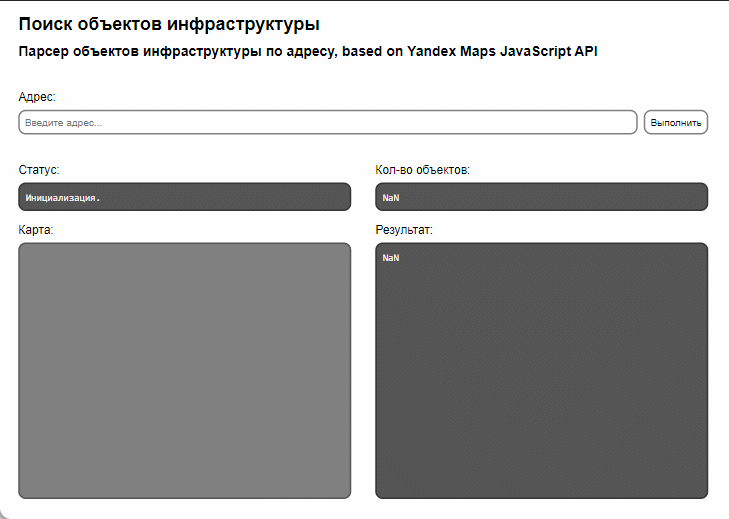

# Поиск объектов инфраструктуры
Парсер объектов по заданному адресу по заданным категориям.

### Алгоритм 
Программа получает координаты места, по которому будет осуществляться поиск, с геокодера (определение адреса в координаты) и устанавливает границу поиска. Затем она ищет объекты в указанной области по заданному списку категорий по 19-ти заданным категориям (магазины, школы, ТЦ, остановки и т.п.). После завершения поиска программа отображает на карте найденные объекты в виде меток (балуны) и формирует список этих объектов в текстовом формате.

В файле index.html замените {YOUR_API_KEY} на свои ключи "Javascript API и HTTP Геокодер", "API Геосаджеста" из кабинета разработчика.

### Лицензия
Лицензия MIT Copyright (c) 2022-2023 Gleb "xenongee" Rublev 

Прежде чем использовать этот скрипт, пожалуйста, ознакомьтесь с условиями использования API Яндекс.Карт.

https://yandex.ru/dev/maps/jsapi/
https://yandex.ru/dev/maps/geosuggest/
https://yandex.ru/dev/maps/geocoder/

А лучше используйте API Поиска по организациям :)
https://yandex.ru/dev/maps/geosearch